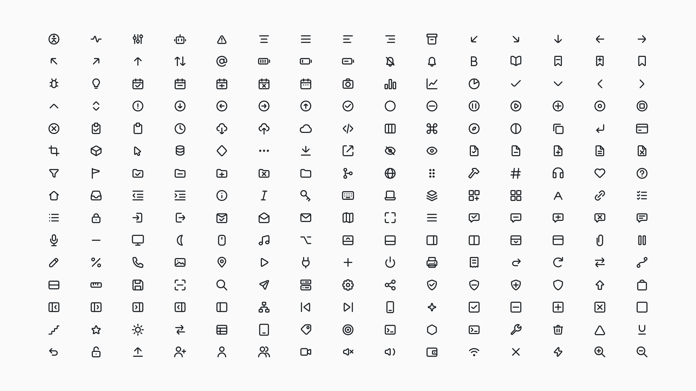

# Regen Icons

> An open-source SVG icon system for agent-built interfaces.

Regen Icons is a focused set of 225 outline icons on a consistent 24px grid. Every icon begins as a small, readable drawing source and is compiled into raw SVGs, React components, a sprite, and a searchable catalog. That makes the set easy to use today and safe for people and agents to extend tomorrow.

Regen is released under the [MIT License](LICENSE) as a contribution to the commons. Use it, adapt it, and help it grow.



## Use the icons

Browse the primary set in [svg/outline](svg/outline). Each icon is a plainly named, standalone SVG you can copy into a project or drag into a design tool. Tonal variants for closed shapes live separately in [svg/filled](svg/filled).

For a searchable local gallery:

```sh
pnpm install --dir generator
pnpm preview
```

This builds the gallery at `generator/dist/preview.html`, where you can search the set and switch size, theme, and style.

## Extend the set

The SVG files are generated. To add or refine an icon, edit its canonical drawing in `generator/src/<name>.icon.json`, then validate and preview it alongside related icons:

```sh
pnpm --dir generator check src/<name>.icon.json
pnpm --dir generator preview <name> <neighbour> --matrix
pnpm test
```

The [drawing guide](generator/docs/spec.md) defines the grid, stroke, geometry, and review conventions. The [contribution guide](CONTRIBUTING.md) explains the full workflow. Coding agents should start with [generator/AGENTS.md](generator/AGENTS.md).

## Package status

The publishable npm package is prepared as `regen-icons` but has not been published yet. Until then, use the SVG files in this repository. The package will include React components, TypeScript types, raw SVGs, a sprite, and `icons.json`.

## Project

Source, issues, and contributions: [github.com/kazdenc/regen-icons](https://github.com/kazdenc/regen-icons)
